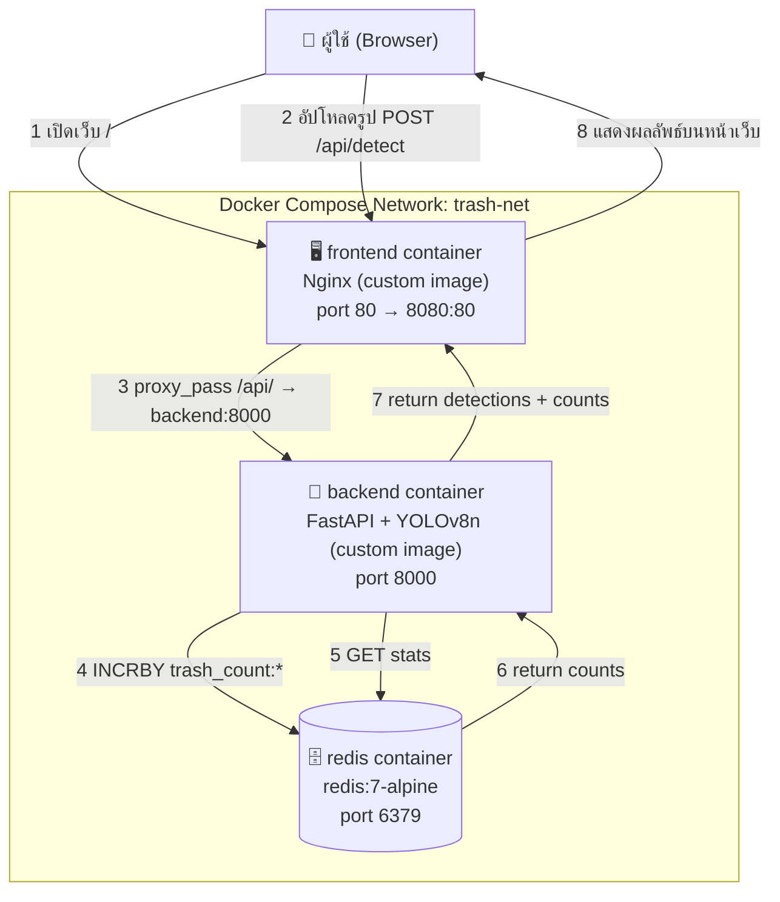

# River Trash Detector Demo (Docker Compose Project)

โปรเจกต์เดโมสำหรับวิชา Dockerfile and Docker Compose
ต่อยอดแนวคิดจากงาน Edge AI river-trash-detection ของผู้เขียน (Jetson Nano + YOLO)
แต่ปรับให้รันผ่าน `docker compose` บนเครื่องคอมพิวเตอร์ทั่วไปได้ โดยไม่ต้องใช้ hardware พิเศษ

ผู้ใช้อัปโหลดรูปภาพผ่านหน้าเว็บ ระบบจะตรวจจับวัตถุประเภท "ขวด/แก้ว" (จำลองแทนขยะลอยน้ำ)
ด้วยโมเดล YOLOv8n แล้วสะสมจำนวนที่ตรวจพบไว้ใน Redis เพื่อแสดงเป็นสถิติบนแดชบอร์ด

## System Diagram



## โครงสร้างโปรเจกต์

```
.
├── docker-compose.yml       # ประกอบ 3 containers เข้าด้วยกัน
├── backend/
│   ├── Dockerfile           # custom image: FastAPI + YOLOv8n
│   ├── requirements.txt
│   └── main.py
└── frontend/
    ├── Dockerfile           # custom image: Nginx + static site
    ├── nginx.conf
    └── index.html
```

## วิธีรัน

```bash
# build ทุก image ใหม่ทั้งหมด ไม่ใช้ cache เดิม (เพื่อให้เห็นทุก layer ตอน build)
docker compose build --no-cache

# รันทุก container แบบ background
docker compose up -d

# ดู log ของแต่ละ container
docker compose logs -f backend

# ปิดและลบ container/network (เก็บ volume redis-data ไว้)
docker compose down
```

จากนั้นเปิดเบราว์เซอร์ไปที่ `http://localhost:8080`

## Services

| Service  | Image                 | สร้างเอง? | หน้าที่                                   |
|----------|------------------------|-----------|--------------------------------------------|
| frontend | build จาก ./frontend    | ✅ ใช่     | เสิร์ฟหน้าเว็บ + proxy ไป backend            |
| backend  | build จาก ./backend     | ✅ ใช่     | รับรูป → รัน YOLOv8n → บันทึกสถิติลง Redis   |
| redis    | redis:7-alpine (official)| ❌ ไม่ (ใช้ official)| เก็บจำนวนขยะสะสม                    |
